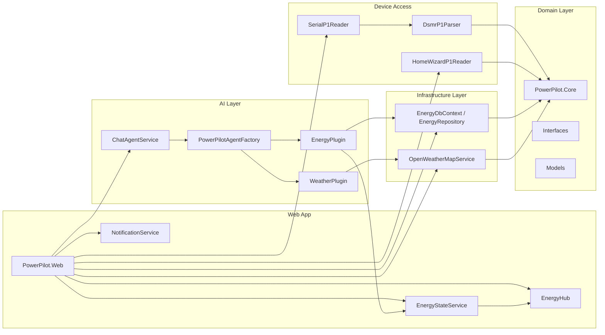

# PowerPilot

An intelligent home energy management assistant built with .NET 8, Blazor, and GitHub Copilot SDK. PowerPilot helps homeowners understand their electricity consumption, solar production, and gas usage by analyzing real-time data from P1 smart meters.


## Features

- 📊 **Real-time Energy Monitoring**: Live data from DSMR P1 smart meters (Belgian/Dutch standard)
- 🤖 **AI-Powered Assistant**: Natural language chat interface powered by GitHub Copilot
- ☀️ **Solar Production Tracking**: Monitor solar panel output and net power balance
- 🌤️ **Weather Integration**: Solar forecasting based on weather conditions
- 💡 **Smart Appliance Advice**: AI recommendations for optimal appliance usage
- 📈 **Historical Analytics**: Track consumption patterns over time (hourly, daily, weekly, monthly)
- ⚡ **Live Power Dashboard**: Real-time visualization of consumption and production

## Architecture

PowerPilot is built using a modular architecture with the following projects:

```
src/
├── PowerPilot.AppHost           # .NET Aspire orchestration
├── PowerPilot.ServiceDefaults   # Shared service configurations
├── PowerPilot.Web               # Blazor web application
├── PowerPilot.Agents            # GitHub Copilot SDK integration
├── PowerPilot.Core              # Domain models and interfaces
├── PowerPilot.Infrastructure    # Data persistence and external services
└── PowerPilot.P1Reader          # P1 smart meter communication
```



### Key Technologies

- **.NET 8**: Modern cross-platform framework
- **Blazor**: Interactive web UI with real-time updates
- **GitHub Copilot SDK**: AI agent orchestration and natural language processing
- **Microsoft.Extensions.AI**: Unified AI abstraction layer
- **.NET Aspire**: Cloud-ready orchestration and telemetry
- **Entity Framework Core**: Data persistence
- **OpenWeatherMap API**: Weather data and solar forecasting

## Prerequisites

- [.NET 10.0 SDK](https://dotnet.microsoft.com/download/dotnet/10.0) or later
- [GitHub Copilot CLI](https://docs.github.com/en/copilot/how-tos/set-up/install-copilot-cli) - Required for AI assistant features
- A DSMR-compliant P1 smart meter (for production use) or use simulated mode
  - Like the ones found here: https://www.fluvius.be/nl/meters-en-meterstanden/digitale-meter/hoe-werkt-mijn-digitale-meter/handleidingen-digitale-elektriciteitsmeters
- **Option A — Serial cable**: A connector cable to access the P1 port (e.g., USB to serial adapter)
  - Like this one: https://www.bol.com/be/nl/p/slimme-meter-kabel-p1-usb/9200000111535827/
- **Option B — HomeWizard P1 Wi-Fi dongle**: A [HomeWizard Wi-Fi P1 meter](https://www.homewizard.com/p1-meter/) plugged into your smart meter's P1 port — no cable or serial driver needed
- OpenWeatherMap API key (optional, for weather features)

### Verify GitHub Copilot CLI Installation

```bash
copilot --version
```

The GitHub Copilot CLI must be authenticated before running PowerPilot.

## Getting Started

### 1. Clone the Repository

```bash
git clone https://github.com/wullemsb/PowerPilot.git
cd PowerPilot
```

### 2. Configure Application Settings

#### Option A: Using User Secrets (Recommended for Development)

```bash
cd src/PowerPilot.Web
dotnet user-secrets init
dotnet user-secrets set "Agent:GitHubToken" "your-github-token"
dotnet user-secrets set "Weather:ApiKey" "your-api-key"
dotnet user-secrets set "Weather:City" "Brussels"
dotnet user-secrets set "P1Reader:SerialPort" "COM3"  # or /dev/ttyUSB0 on Linux
```

#### Option B: Using appsettings.json

Create or edit `src/PowerPilot.Web/appsettings.Development.json`:

```json
{
  "Agent": {
    "GitHubToken": "your-github-token-here",
    "Model": "gpt-4.1",
    "CliPath": null,
    "CliUrl": null
  },
  "Weather": {
    "ApiKey": "your-api-key-here",
    "City": "Brussels",
    "Units": "metric"
  },
  "MeterSource": "Choose: Simulated , Serial , HomeWizard",
  "P1Reader": {
    "Mode": "Serial",
    "SerialPort": "COM3",
    "BaudRate": 115200
  },
  "HomeWizard": {
    "IpAddress": "192.168.1.100",
    "PollingIntervalSeconds": 10
  },
  "ConnectionStrings": {
    "DefaultConnection": "Data Source=powerpilot.db"
  }
}
```

### 3. Run the Application

#### Using .NET Aspire (Recommended)

```bash
cd src/PowerPilot.AppHost
dotnet run
```

This will start the Aspire dashboard and the PowerPilot web application.

#### Direct Run (Without Aspire)

```bash
cd src/PowerPilot.Web
dotnet run
```

Navigate to `https://localhost:5001` (or the URL shown in the console).

## Configuration

### GitHub Copilot Agent Options

Configure the AI agent in `appsettings.json`:

```json
{
  "Agent": {
    "GitHubToken": "ghp_your_token_here",
    "Model": "gpt-4.1",
    "CliPath": null,
    "CliUrl": null
  }
}
```

- **GitHubToken**: Your GitHub personal access token with Copilot access
- **Model**: GitHub Copilot model to use for both interactive chat and background monitoring (e.g., `gpt-4.1`, `claude-sonnet-4.5`)
- **CliPath**: Optional custom path to Copilot CLI binary
- **CliUrl**: Optional URL for remote Copilot CLI service

### P1 Smart Meter Configuration

PowerPilot supports three reader modes, selected via `P1Reader:Mode`:

| Mode | Description |
|------|-------------|
| `Serial` | Physical P1 serial cable connected to the smart meter |
| `HomeWizard` | HomeWizard Wi-Fi P1 dongle, polled over HTTP |
| _(anything else)_ | Simulated data — no hardware required |

#### Serial mode

```json
{
  "MeterSource": "Serial",
  "P1Reader": {
    "SerialPort": "COM3",
    "BaudRate": 115200
  }
}
```

#### HomeWizard mode

```json
{
  "MeterSource": "HomeWizard",
  "HomeWizard": {
    "IpAddress": "192.168.1.100",
    "PollingIntervalSeconds": 10
  }
}
```

Set the `IpAddress` to the local IP address of your HomeWizard P1 dongle. PowerPilot polls the HomeWizard local API (`/api/v1/data`) at the configured interval.

#### Simulated mode

Omit `Mode` (or set it to any unrecognised value) to use simulated data for development and testing — no physical meter required.

### Weather Service Configuration

```json
{
  "Weather": {
    "ApiKey": "your-api-key",
    "City": "Brussels",
    "Units": "metric"
  }
}
```

Get a free API key from [OpenWeatherMap](https://openweathermap.org/api).

## Usage

### Chat with the AI Assistant

Ask PowerPilot questions in natural language:

- "What's my current power usage?"
- "How much energy did I consume today?"
- "When is the best time to run my dishwasher?"
- "What's the solar forecast for this afternoon?"
- "Show me my hourly usage pattern"

### Available AI Tools

The PowerPilot assistant has access to the following tools:

| Tool | Description |
|------|-------------|
| `get_current_power` | Get real-time power consumption and production in kW |
| `get_today_stats` | Energy statistics for today |
| `get_energy_stats` | Historical stats for a time period (today, yesterday, week, month) |
| `get_hourly_profile` | Hourly energy profile to understand usage patterns |
| `get_appliance_advice` | Optimal time to run high-power appliances |
| `get_current_weather` | Current weather conditions and solar irradiance |
| `get_solar_forecast` | 24-hour solar production forecast |

## Development

### Project Structure

```
PowerPilot/
├── src/
│   ├── PowerPilot.Agents/
│   │   ├── ChatAgentService.cs       # Main Copilot session manager
│   │   ├── PowerPilotAgentFactory.cs # Client and tool factory
│   │   └── Plugins/
│   │       ├── EnergyPlugin.cs       # Energy data tools
│   │       └── WeatherPlugin.cs      # Weather tools
│   ├── PowerPilot.Core/
│   │   ├── Models/                   # Domain models (P1Telegram, etc.)
│   │   └── Interfaces/               # Service contracts
│   ├── PowerPilot.Infrastructure/
│   │   ├── Data/                     # EF Core DbContext
│   │   └── Weather/                  # OpenWeatherMap integration
│   ├── PowerPilot.P1Reader/
│   │   ├── HomeWizardP1Reader.cs     # HomeWizard Wi-Fi P1 dongle reader
│   │   ├── SerialP1Reader.cs         # Serial cable P1 reader
│   │   ├── SimulatedP1Reader.cs      # Simulated data for testing
│   │   └── DsmrP1Parser.cs           # DSMR protocol parser
│   └── PowerPilot.Web/
│       ├── Components/               # Blazor components
│       └── Program.cs                # Application entry point
└── tests/
    └── PowerPilot.Tests/
```

### Adding a New Agent Tool

1. Create a method in the appropriate plugin (e.g., `EnergyPlugin.cs`):

```csharp
public async Task<string> GetMyNewTool(string parameter)
{
    // Your implementation
    return "Result";
}
```

2. Register the tool in `PowerPilotAgentFactory.BuildTools()`:

```csharp
Tool((string param) => energyPlugin.GetMyNewTool(param),
    "get_my_new_tool",
    "Description of what this tool does")
```

### Running Tests

```bash
dotnet test
```

## P1 Smart Meter Protocol

PowerPilot supports two ways of reading your smart meter:

### Serial (DSMR)

Reads DSMR (Dutch Smart Meter Requirements) P1 telegrams directly over a serial connection. The P1 port outputs a telegram every 10 seconds (typically at 115200 baud, 8N1), which `DsmrP1Parser` decodes from raw text.

### HomeWizard Wi-Fi P1

Polls the HomeWizard local HTTP API (`http://<ip>/api/v1/data`) at a configurable interval (default 10 seconds). No serial driver or cable is required — the dongle connects to your home Wi-Fi and exposes the meter data as JSON.

> **Note**: The HomeWizard v1 API does not include a per-tariff breakdown. Total import is mapped to Tariff 1; Tariff 2 is always zero.

### Supported Fields

- Electricity delivered/returned (both tariffs)
- Current power usage/delivery
- Tariff indicator
- Gas delivery (hourly reading)
- Equipment identifier

## Telemetry and Observability

When running with .NET Aspire, PowerPilot automatically exports telemetry to the Aspire Dashboard:

- **Traces**: GitHub Copilot SDK operations, HTTP requests
- **Metrics**: Request rates, durations
- **Logs**: Structured logging from all services

Access the dashboard at `http://localhost:15888` when running via AppHost.

## Troubleshooting

### GitHub Copilot CLI Not Found

Ensure the Copilot CLI is installed and in your PATH:

```bash
which copilot  # Linux/macOS
where copilot  # Windows
```

Install from: https://docs.github.com/en/copilot/how-tos/set-up/install-copilot-cli

### Serial Port Access Denied

On Linux, add your user to the `dialout` group:

```bash
sudo usermod -a -G dialout $USER
```

Log out and back in for changes to take effect.

On Windows, ensure no other application is using the COM port.

### HomeWizard Device Not Responding

Ensure the HomeWizard P1 dongle is on the same local network and that the local API is enabled in the HomeWizard app (**Settings → Meters → Enable API**). Verify connectivity by opening `http://<ip>/api/v1/data` in a browser — it should return a JSON response. If the IP address changes, consider assigning a static DHCP lease for the dongle in your router.

### Database Migration Issues

Delete the existing database and let EF Core recreate it:

```bash
rm src/PowerPilot.Web/powerpilot.db
dotnet run
```

## Contributing

Contributions are welcome! Please feel free to submit a Pull Request.

1. Fork the repository
2. Create your feature branch (`git checkout -b feature/amazing-feature`)
3. Commit your changes (`git commit -m 'Add some amazing feature'`)
4. Push to the branch (`git push origin feature/amazing-feature`)
5. Open a Pull Request

## License

This project is licensed under the MIT License - see the LICENSE file for details.

## Acknowledgments

- Built with [GitHub Copilot SDK](https://github.com/github/copilot-sdk)
- Weather data from [OpenWeatherMap](https://openweathermap.org/)
- DSMR P1 protocol documentation from [Netbeheer Nederland](https://www.netbeheernederland.nl/)

## Support

For issues and questions:
- Open an [issue](https://github.com/wullemsb/PowerPilot/issues)
- Check the [GitHub Copilot SDK documentation](https://github.com/github/copilot-sdk)

---

Made with ⚡ by the PowerPilot team
